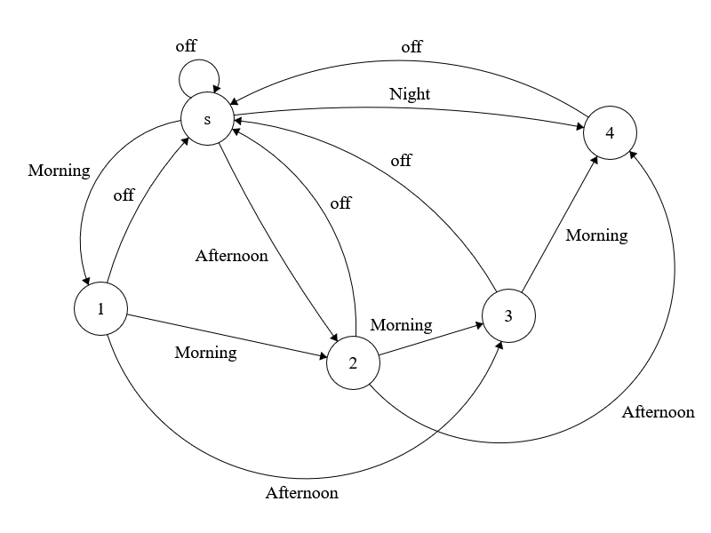

## Problem Overview – Flight Control Center

This problem involves generating a weekly shift schedule for air traffic controllers in a flight control center. The goal is to assign one of four possible shifts to each controller for each day of a 7-day week, while satisfying a set of operational and fairness constraints.

### Shifts and Rules

There are four shift types:
- `MORNING` (1 point)
- `AFTERNOON` (2 points)
- `NIGHT` (4 points)
- `OFF` (0 points)

Controllers accumulate points based on the shifts they work. Once a controller accumulates **4 points**, they are **required to take a day off**. The accumulation resets after the day off.

Controllers may:
- Take a day off after any shift.
- Have multiple consecutive days off.
- Accumulate exactly 4 points over multiple days before being required to rest.

### Staffing Constraints

Each day must meet the following minimum staffing requirements:
- At least **3 controllers** on the **morning** shift.
- At least **2 controllers** on the **afternoon** shift.
- At least **1 controller** on the **night** shift.

### Individual Constraints

Each controller must:
- Work **at least one** `MORNING`, `AFTERNOON`, and `NIGHT` shift during the 7-day period.

### Objective

The objective is to create a valid schedule that:
- Satisfies all the above constraints.
- Minimizes the **gap**, defined as the **difference** between the **maximum and minimum** total points accumulated by any controller over the week.

### Input Example

```minizinc
air_t_controllers = 10;
```

### Sample Solution Output

```minizinc
% Just for debugging. The table of shifts.
%         1         2         3         4         5         6         7
%        OFF AFTERNOON AFTERNOON       OFF     NIGHT       OFF   MORNING
%    MORNING AFTERNOON       OFF     NIGHT       OFF   MORNING   MORNING
%        OFF     NIGHT       OFF AFTERNOON AFTERNOON       OFF   MORNING
%      NIGHT       OFF   MORNING       OFF   MORNING   MORNING AFTERNOON
%  AFTERNOON   MORNING       OFF AFTERNOON       OFF     NIGHT       OFF
%  AFTERNOON   MORNING       OFF   MORNING   MORNING       OFF     NIGHT
%    MORNING   MORNING   MORNING       OFF AFTERNOON       OFF     NIGHT
%      NIGHT       OFF   MORNING   MORNING       OFF AFTERNOON   MORNING
%    MORNING       OFF     NIGHT       OFF   MORNING   MORNING AFTERNOON
%      NIGHT       OFF AFTERNOON   MORNING       OFF AFTERNOON       OFF

roster = [OFF, AFTERNOON, AFTERNOON, OFF, NIGHT, OFF, MORNING, MORNING, AFTERNOON, OFF, NIGHT, OFF, MORNING, MORNING, OFF, NIGHT, OFF, AFTERNOON, AFTERNOON, OFF, MORNING, NIGHT, OFF, MORNING, OFF, MORNING, MORNING, AFTERNOON, AFTERNOON, MORNING, OFF, AFTERNOON, OFF, NIGHT, OFF, AFTERNOON, MORNING, OFF, MORNING, MORNING, OFF, NIGHT, MORNING, MORNING, MORNING, OFF, AFTERNOON, OFF, NIGHT, NIGHT, OFF, MORNING, MORNING, OFF, AFTERNOON, MORNING, MORNING, OFF, NIGHT, OFF, MORNING, MORNING, AFTERNOON, NIGHT, OFF, AFTERNOON, MORNING, OFF, AFTERNOON, OFF]; 
work = [9, 9, 9, 9, 9, 9, 9, 9, 9, 9]; 
gap=0;
```

### FSM-Based Solution Approach

To enforce the rule that controllers must take a day off after accumulating 4 points from shifts, the sequence of accepted shifts is modeled using a finite state machine (FSM). This FSM tracks the cumulative points in total and forces an "off" transitions once the 4-point threshold is reached.
The behavior is implemented in MiniZinc using the **regular** constraint, which ensures that each controller's weekly shift sequence conforms to the FSM.




